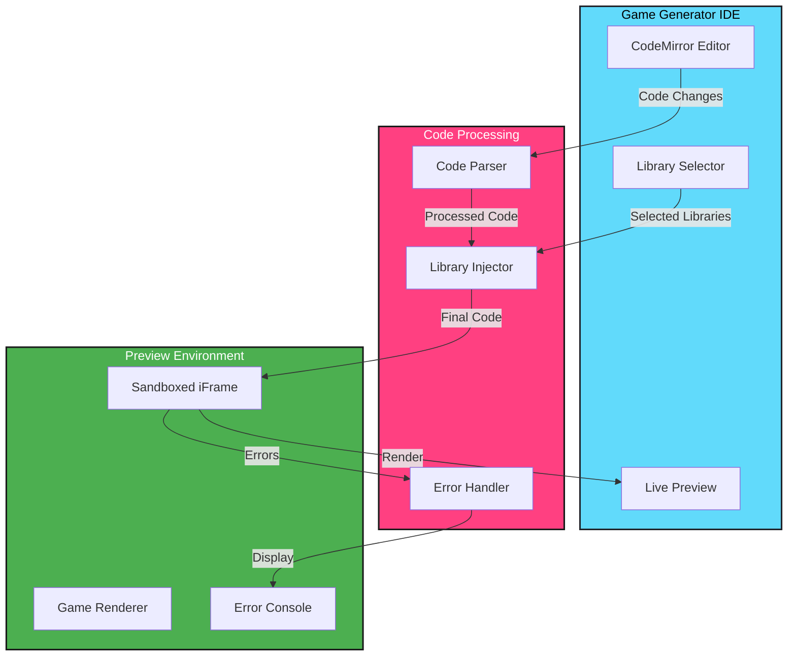

# 🎮 Game Generator: Live JavaScript Game Editor

## 🎯 Overview
Game Generator is an interactive JavaScript game development environment with live preview. Write game code and see it come to life instantly. Perfect for prototyping game ideas or learning game development concepts.

## ✨ Key Features
- Live JavaScript editor using CodeMirror
- Real-time preview with iframe
- Popular game library integrations
- One-click library selection
- Instant code execution
- Clean development interface

## 🛠️ Tech Stack
- 
- 
- 
- 

## 🎮 Supported Game Libraries
- P5.js - Creative coding and visualization
- PixiJS - 2D WebGL renderer
- Phaser - Feature-rich 2D game framework

## 🏗️ Architecture


## 💡 Features

### Code Editor
- Syntax highlighting
- Auto-completion
- Error detection
- Multiple themes
- Code formatting

### Live Preview
- Real-time rendering
- Error reporting
- Responsive display
- Frame rate monitoring

### Library Integration
- One-click library addition
- Latest CDN versions
- Multiple library support
- Clean initialization

## 🔄 Future Plans
Currently working on an enhanced version:
- Partnership with [The Good Game Theory](https://www.thegoodgametheory.com/)
- No-code game development interface
- Advanced game mechanics
- Visual component system
- Asset management
- Project temporarily parked for future development

## ⚙️ Setup
1. Clone repository
2. Install dependencies
3. Start development server
4. Open browser and start coding

## 📝 How to Use

### Creating a Game
1. Select game libraries
2. Write JavaScript code
3. See live preview
4. Iterate and refine

### Example Game
A simple bouncing ball:
```javascript
// Simple bouncing ball using P5.js
let x = 200;
let y = 200;
let xSpeed = 5;
let ySpeed = 5;
const ballSize = 30;

function setup() {
  createCanvas(400, 400);
}

function draw() {
  background(220);
  
  // Draw the ball
  fill(255, 0, 0);
  ellipse(x, y, ballSize, ballSize);
  
  // Move the ball
  x += xSpeed;
  y += ySpeed;
  
  // Check for collisions
  if (x + ballSize/2 > width || x - ballSize/2 < 0) {
    xSpeed *= -1;
  }
  if (y + ballSize/2 > height || y - ballSize/2 < 0) {
    ySpeed *= -1;
  }
}
```

## 🤝 Contributing
1. Fork repository
2. Create feature branch
3. Submit pull request

## 📜 License
[MIT](LICENSE)
